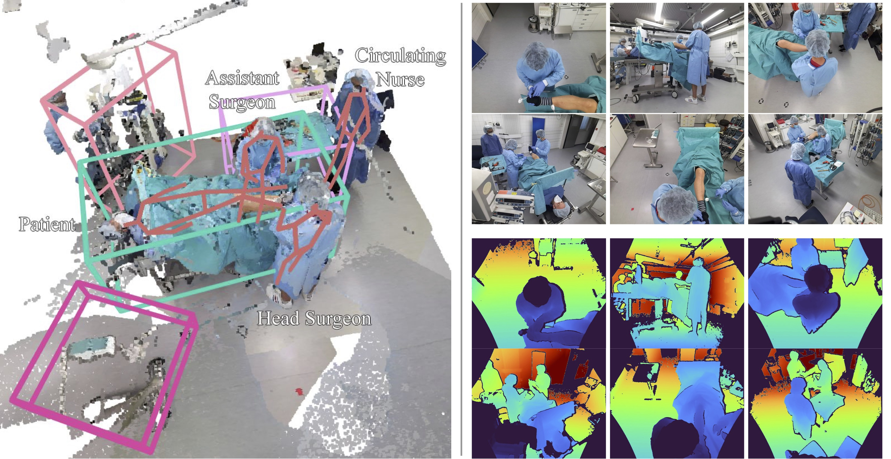
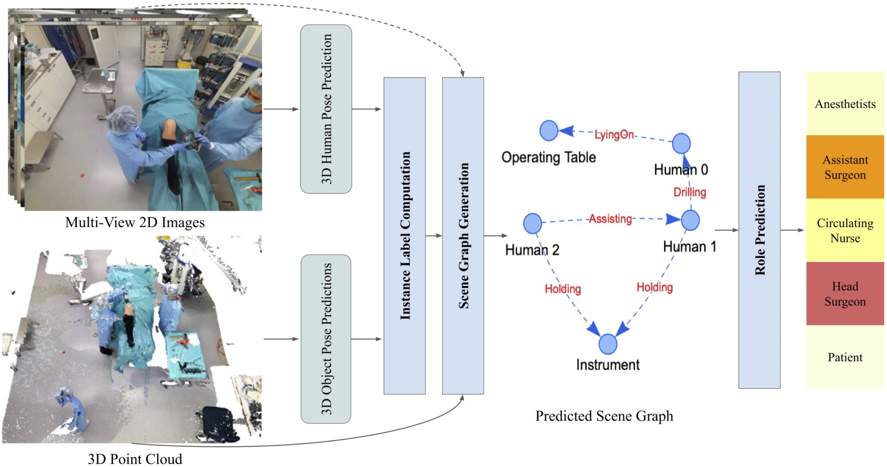

# 4D-OR: Semantic Scene Graphs for OR Domain Modeling
Official code of the paper 4D-OR: Semantic Scene Graphs for OR Domain Modeling (https://link.springer.com/chapter/10.1007/978-3-031-16449-1_45) published at MICCAI 2022. 

PDF Paper: https://link.springer.com/content/pdf/10.1007/978-3-031-16449-1_45.pdf?pdf=inline%20link  
PDF Book: https://link.springer.com/content/pdf/10.1007/978-3-031-16449-1.pdf?pdf=button%20sticky  
Oral Presentation at MICCAI22: https://youtu.be/U_VUr-IPIPE  
We publish both a new dataset, 4D-OR and our code.



**Authors**: [Ege Özsoy][eo], [Evin Pınar Örnek][epo], [Ulrich Eck][ue], [Tobias Czempiel][tc], [Federico Tombari][fede], [Nassir Navab][nassir]

[eo]:https://www.cs.cit.tum.de/camp/members/ege-oezsoy/
[epo]:https://www.cs.cit.tum.de/camp/members/evin-pinar-oernek/
[ue]:https://www.cs.cit.tum.de/camp/members/ulrich-eck/
[tc]:https://www.cs.cit.tum.de/camp/members/tobias-czempiel/
[fede]:https://www.cs.cit.tum.de/camp/members/senior-research-scientists/federico-tombari/
[nassir]:https://www.cs.cit.tum.de/camp/members/cv-nassir-navab/nassir-navab/

```
@inproceedings{Özsoy2022_4D_OR,
    title={4D-OR: Semantic Scene Graphs for OR Domain Modeling},
    author={Ege Özsoy, Evin Pınar Örnek, Ulrich Eck, Tobias Czempiel, Federico Tombari, Nassir Navab},
    booktitle={International Conference on Medical Image Computing and Computer-Assisted Intervention},
    year={2022},
    organization={Springer}
}
@inproceedings{Özsoy2021_MSSG,
    title={Multimodal Semantic Scene Graphs for Holistic Modeling of Surgical Procedures},
    author={Ege Özsoy, Evin Pınar Örnek, Ulrich Eck, Federico Tombari, Nassir Navab},
    booktitle={Arxiv},
    year={2021}
}

```
### In the extended version of our paper, which is published at IJCARS () we add a secondary downstream task, which is surgery phase recognition, where we get excellent results. We update this repository to include the new surgical phase labels as well as the code to predict them.

### LABRAD-OR (https://github.com/egeozsoy/LABRAD-OR) achieves significantly higher results, by using temporal information in form of memory scene graphs.


## 4D-OR Dataset

4D-OR includes a total of 6734 scenes, recorded by six calibrated RGB-D Kinect sensors 1 mounted to the ceiling of the OR, with one frame-per-second, providing
synchronized RGB and depth images. We provide fused point cloud sequences of entire scenes, automatically annotated human 6D poses and 3D bounding boxes for OR
objects. Furthermore, we provide SSG annotations for each step of the surgery together with the clinical roles of all the humans in the scenes, e.g., nurse,
head surgeon, anesthesiologist. More details are provided in the paper.

To use it:

- Fill out this form https://forms.gle/9cR3H5KcFUr5VKxr9 to get access to the download link. By filling out this form, you agree to the terms of use of the
  dataset.
- After downloading, unzip the dataset and put it into the datasets folder.

## 2D, 3D Human Pose Prediction and 3D Object Pose Prediction (External Code)

Please refer to README in external_src. The rest assumes you have completed the steps described in that README.

## Create Scene Graph Prediction Environment (Can be used for the rest of the tasks)

- Recommended PyTorch Version: pytorch==1.10.0
- conda create -n SceneGraphPrediction python=3.7
- conda activate SceneGraphPrediction
- conda install pytorch==1.10.0 torchvision==0.11.0 torchaudio==0.10.0 cudatoolkit=11.3 -c pytorch -c conda-forge
- `cd` into scene_graph_prediction and run `pip install -r requirements.txt`
- Run `wget https://github.com/egeozsoy/4D-OR/releases/download/v0.1/scene_graph_prediction_files.zip` and unzip
- (Optional) To use the pretrained models, Move `paper_model_no_gt_no_images.pth` and `paper_model_no_gt_with_images.pth.pth`
  to `scene_graph_prediction/scene_graph_helpers/paper_weights`
- `cd` into pointnet2_dir and (optionally run `pip install -r requirements.txt`) and then run `CUDA_HOME=/usr/local/cuda-11.3 pip install pointnet2_ops_lib/.`
Run `pip install torch-scatter==2.0.9 torch-sparse==0.6.12 torch-cluster==1.5.9 torch-spline-conv==1.2.1 torch-geometric==2.0.2 -f https://data.pyg.org/whl/torch-1.10.0+cu113.html`

## Instance Label Computation (Project Human and Object Pose Detections to Point Cloud)

- `cd` to root dir
- compute instance labels by running `python compute_instance_labels.py`. There are some parameters you can adjust. Alternatively, you can just download the
  instance_labels from github, and put them into the INSTANCE_LABELS_PRED_PATH folder.

## Scene Graph Prediction




We use https://github.com/ShunChengWu/3DSSG as a starting point for our scene graph prediction codebase.

- `cd` into scene_graph_prediction
- To train a new model using only point cloud, run `python -m scene_graph_prediction.main --config no_gt.json`
- To train a new model using point clouds and images, run `python -m scene_graph_prediction.main --config no_gt_image.json`
- To evaluate either a model you trained or a pretrained model from us, change the mode to `evaluate` and rerun using the same command as before
  - If you want to replicate the results from the paper, we provide two weights, in the folder scene_graph_prediction/scene_graph_helpers/paper_weights. Just
    change the variable paper_weight = None to the corresponding path
- To infer on the test set, change the mode to `infer` run `python -m scene_graph_prediction.main --config no_gt.json`
  or  `python -m scene_graph_prediction.main --config no_gt_image.json`. You can use the paper weights again as described before
  - By default, evaluation is done on the validation set, and inference on test, but these can be changed.
  - If you want to continue with the downstream task of role prediction, make sure to either infer for train, and val, or download our results from GitHub.
    Place them (scan_relations_training_no_gt_*) inside the root folder.
- You can evaluate on the test set as well by using https://bit.ly/4D-OR_evaluator and uploading your inferred predictions. Be aware that compared to the
  evaluation in the paper, this evaluation does not require human poses to be available, and therefore can slightly overestimate the results. We get a macro
  0.76 instead of 0.75 on test set.
- You can visualize the results by using the script `visualize_scene_graph_predictions.py`

## Case Study: Role Prediction

- Run `python -m role_prediction.heuristic_based_role_prediction` to use heuristics to predict roles
- Run the following to use Graphormer to predict rolers. Adjust settings in
  role_prediction_configs `python -m role_prediction.graphormer.entry --num_workers 12 --batch_size 1 --dataset_name role_prediction --gpus 1 --accelerator ddp --precision 16 --ffn_dim 80 --hidden_dim 80 --num_heads 8 --dropout_rate 0.1 --attention_dropout_rate 0.1 --intput_dropout_rate 0.1 --n_layers 12 --peak_lr 2e-4 --edge_type multi_hop --multi_hop_max_dist 5 --spatial_pos_max 16 --check_val_every_n_epoch 10 --warmup_updates 40000 --tot_updates 400000 --default_root_dir role_prediction_save_dir_images`
- Run the following to infer using Graphormer for the test set. If you want to predict for train or validation sets, manually change the variable in
  data.py. `python -m role_prediction.graphormer.entry --num_workers 12 --batch_size 1 --dataset_name role_prediction --gpus 1 --accelerator ddp --precision 16 --ffn_dim 80 --hidden_dim 80 --num_heads 8 --dropout_rate 0.1 --attention_dropout_rate 0.1 --intput_dropout_rate 0.1 --n_layers 12 --peak_lr 2e-4 --edge_type multi_hop --multi_hop_max_dist 5 --spatial_pos_max 16 --check_val_every_n_epoch 10 --default_root_dir save_dir --checkpoint_path role_prediction_save_dir_images/lightning_logs/checkpoints/role_prediction-epoch=199-valid_ap=0.0000.ckpt --test --role_prediction_save_name graphormer_based_role_predictions.json`

## Case Study: Surgery Phase Recognition

- Run `python -m surgery_phase_recognition.recognize_surgery_phase` to predict surgery phases from scene graphs
- Run `python -m surgery_phase_recognition.evaluate_surgery_phase_recognition` to evaluate the results.